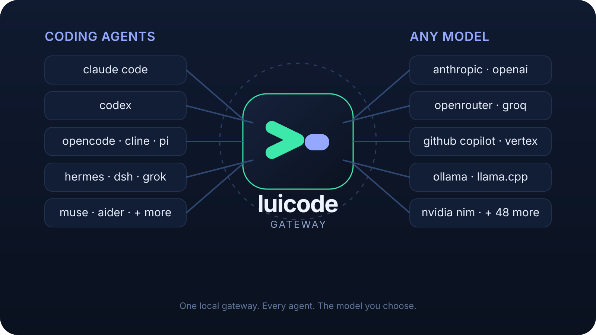

<div align="center">

<h1>
  <picture>
    <source media="(prefers-color-scheme: light)" srcset="assets/luicode-wordmark-light.svg">
    
  </picture>
</h1>

<p>
  <em>The local gateway for agentic coding.</em>
</p>

[](https://opensource.org/licenses/MIT)
[](https://www.python.org/downloads/)
[](https://github.com/astral-sh/uv)
[](https://github.com/Luigibarte4563/luicode/actions/workflows/tests.yml)
[](https://pypi.org/project/ty/)
[](https://github.com/astral-sh/ruff)
[](https://github.com/Delgan/loguru)
[](https://github.com/browser-use/browser-harness)

[Quick Start](#quick-start) · [Agents](#supported-coding-agents) · [Providers](#choose-a-provider) · [Editors & Apps](#connect-editors-and-apps) · [Optional Features](#optional-features) · [Manage](#manage-your-installation)

</div>

<p align="center">
  <em>Independent open-source project. Not affiliated with or endorsed by Anthropic. Claude and Claude Code are trademarks of Anthropic.</em>
</p>

---

## What is luicode?

luicode is a local gateway that lets your favorite coding agents run against one unified catalog of provider models: free tiers, subscriptions, and local servers. You configure everything in one place, a browser-based Admin UI, and every agent you connect uses the same setup.

### Highlights

- **55 ToS-friendly providers, 1.3B+ free tokens every month.** Use free, paid, subscription, and local models from one searchable UI without putting your account at risk. luicode follows provider terms and removes integrations if they stop being allowed. _(Free-tier availability and limits are set by each provider and may change.)_
- **10 coding agents, one model catalog.** Use the same models in [Claude Code](https://code.claude.com/docs/en/overview), [Codex](https://github.com/openai/codex), [Pi](https://github.com/earendil-works/pi), [OpenCode](https://github.com/anomalyco/opencode), [Cline](https://github.com/cline/cline), [Hermes](https://github.com/NousResearch/hermes-agent), [DeepSeek Harness](https://github.com/deepseek-ai/deepseek-harness), [Grok Build](https://github.com/xai-org/grok-build), [Muse Code](https://research.meta.ai/blog/introducing-muse-code-and-muse-spark-1-2/), and [Aider](https://aider.chat/).
- **Keeps working through provider outages.** After retries are exhausted, luicode automatically tries your next configured model without making you restart the turn, across every client.
- **Up to 90% fewer terminal-output tokens.** Optional [RTK](https://github.com/rtk-ai/rtk) filters common command output, while five built-in optimizations handle quota probes, command-prefix detection, titles, suggestions, and filepaths without calling a provider.
- **Native Code sessions in your browser.** Choose a folder and run Codex in the browser, with real-time and background support. Switch providers and models freely within the same session. (Switching harnesses in the same session is coming soon.)
- **Terminal, desktop, IDE, or phone.** Work through native launchers, [VS Code](https://code.visualstudio.com/), [Codex App](https://learn.chatgpt.com/docs/app), [JetBrains](https://www.jetbrains.com/), [Discord](https://discord.com/), or [Telegram](https://telegram.org/).
- **Voice notes in, code out.** Talk to your agent using local [Whisper](https://github.com/openai/whisper) or [NVIDIA NIM](https://docs.nvidia.com/nim/speech/latest/asr/deploy-asr-models/whisper.html) transcription.
- **Agent capabilities stay intact.** Streaming, tool use, native interleaved thinking, and image input all keep working. You can also route [Fable](https://www.anthropic.com/claude/fable), [Opus](https://www.anthropic.com/claude/opus), [Sonnet](https://www.anthropic.com/claude/sonnet), and [Haiku](https://www.anthropic.com/claude/haiku) tiers independently to compatible models.
- **Browser automation (optional).** Let agents navigate, click, fill forms, and extract data from web pages via Chrome DevTools Protocol, powered by the same engine as [JEV-Ultrafast](https://github.com/browser-use/jev-ultrafast).

## How It Works

<div align="center">
  
</div>

luicode runs one local gateway process, `luicode-server`. Coding agents connect to it through `luicode-*` launchers or IDE/app integrations. The gateway then routes each request to the provider and model you picked, applying fallbacks, reasoning control, and token-saving optimizations along the way.

## Table of Contents

1. [Quick Start](#quick-start)
2. [Supported Coding Agents](#supported-coding-agents)
3. [Choose a Provider](#choose-a-provider)
4. [Connect Editors and Apps](#connect-editors-and-apps)
5. [Optional Features](#optional-features) (messaging bots, voice notes, browser automation)
6. [Manage Your Installation](#manage-your-installation) (update, uninstall)
7. [Project Links](#project-links) and [License](#license)

---

## Quick Start

Getting running takes four steps: **install → start the server → add one provider key → launch an agent.**

<a id="install"></a>

### 1. Install

Pick your platform and run the command. The installer will ask you to choose at least one coding agent, and optionally RTK. You can review the scripts first: [install.sh](scripts/install.sh) · [install.ps1](scripts/install.ps1).

**macOS / Linux**

```bash
curl -fsSL "https://raw.githubusercontent.com/Luigibarte4563/luicode/main/scripts/install.sh" | sh
```

**Windows (PowerShell)**

```powershell
& ([scriptblock]::Create((irm "https://raw.githubusercontent.com/Luigibarte4563/luicode/main/scripts/install.ps1")))
```

**Android (Termux)**

Install [Termux](https://f-droid.org/packages/com.termux/) from F-Droid first, then run the same single command as macOS/Linux:

```bash
curl -fsSL "https://raw.githubusercontent.com/Luigibarte4563/luicode/main/scripts/install.sh" | sh
```

<details>
<summary><strong>What the Termux installer does</strong></summary>

The installer detects Termux automatically and:

- updates the Termux package lists and installs only the packages you are missing (`python`, `git`, `curl`)
- checks that Python is new enough (3.14 or newer)
- keeps the source checkout in `~/.luicode-src`, never in `~/.luicode`, which holds your configuration and data
- installs luicode into that checkout with `pip install -e .`
- adds the directory holding `luicode` and `luicode-server` to your `PATH` from `~/.bashrc` or `~/.zshrc`, inside a single managed `# >>> LUICode PATH >>>` block so reruns never duplicate it
- verifies that both commands run, and prints the web interface URL

Open a **new** Termux session afterwards.

**Good to know**

- Coding agents (Claude Code, Codex, OpenCode, …) are installed separately with the Linux installer. The Termux one-command install covers the gateway itself.
- `termux-wake-lock` is never run for you. The installer only prints it as an optional tip.
- Local Whisper and browser automation are not available on Android.

See [docs/android.md](docs/android.md) for persistence, wake locks, auto-start (Termux:Boot), notifications (Termux:API), LAN access, and how to update or uninstall.

</details>

### 2. Start luicode

| Platform             | How to start                                               |
| -------------------- | ---------------------------------------------------------- |
| **Windows**          | Open **luicode** from your desktop or Start menu.          |
| **macOS**            | Open **luicode** from your desktop or Applications folder. |
| **Linux**            | Run `luicode-server` in a terminal.                        |
| **Android (Termux)** | Open a **new** Termux session, then run `luicode-server`.  |

`luicode` is an alias for the same server, so either command works.

The server listens on port **8082** by default, so the Admin UI is at <http://127.0.0.1:8082/admin>. Change the port with `PORT` in `~/.luicode/.env`.

luicode opens the Admin UI after starting:

- **Windows / macOS:** use the tray or menu-bar icon to open Admin, restart, or quit.
- **Android:** use `termux-open-url` to open the Admin UI. For background persistence, run `termux-wake-lock` first and disable battery optimization.
- **Terminal (`luicode-server`):** keep the terminal open while you work.

<a id="nvidia-nim-provider"></a>

### 3. Configure your first provider (NVIDIA NIM)

NVIDIA NIM is the default and works well as a first provider.

1. Create an API key at [build.nvidia.com/settings/api-keys](https://build.nvidia.com/settings/api-keys).
2. Open the Admin UI URL shown in the server log.
3. Paste the key into `NVIDIA_NIM_API_KEY`.
4. Leave `MODEL` on the default `nvidia_nim/nvidia/nemotron-3-super-120b-a12b`, or search the model dropdown and pick another model.
5. Click **Apply**.

> **Tip:** To protect the local proxy with a bearer token, enable **Proxy Authentication** in Admin.

Want a different provider? See [Choose a Provider](#choose-a-provider).

### 4. Run a coding agent

In a new terminal, run the launcher for the agent you installed, for example:

```bash
luicode-claude
```

The full list of launchers is in the next section.

---

## Supported Coding Agents

Start `luicode-server` first, then run the matching launcher in your terminal.

| Agent                  | Launcher           |
| ---------------------- | ------------------ |
| Claude Code            | `luicode-claude`   |
| Codex                  | `luicode-codex`    |
| Pi                     | `luicode-pi`       |
| OpenCode 2             | `luicode-opencode` |
| Cline                  | `luicode-cline`    |
| Hermes                 | `luicode-hermes`   |
| DeepSeek Harness (Web) | `luicode-dsh`      |
| Grok Build             | `luicode-grok`     |
| Muse Code              | `luicode-muse`     |
| Aider                  | `luicode-aider`    |

### OpenCode notes

- Use `luicode-opencode` for coding and sessions. Use plain `opencode` for other commands such as upgrades, service management, ACP, and MCP setup.
- **Upgrading from OpenCode 1:** close OpenCode, then rerun the luicode installer with OpenCode selected. It upgrades the native installation in `~/.opencode/bin`. If you installed OpenCode through npm or another package manager, follow [OpenCode's migration instructions](https://opencode.ai/v2/docs/migrate-v1/) first. For npm v1, run `npm uninstall -g opencode-ai`, then rerun the luicode installer. OpenCode manages its own data upgrades.
- RTK integration is temporarily unavailable for OpenCode 2. RTK continues to work with all other supported agents.

---

## Choose a Provider

### Setup steps

1. Open a provider link in the catalog below to get its key, models, or setup instructions.
2. In the Admin UI, fill in the listed setting. (For OpenAI / ChatGPT subscription access, use **Providers → OAuth providers** instead.)
3. Search the `MODEL` dropdown and select a model. If the provider can't list models, type `<provider-id>/<exact-provider-model-id>` manually.
4. Click **Apply**.

**Optional:** add an ordered **Fallback Models** list under **Model config**. It applies to every connected client. A failed request may reach, and consume usage from, more than one provider before succeeding.

### Provider catalog

<details>
<summary><strong>Sign-in providers (subscription accounts)</strong></summary>

| Provider                                                                                   | Admin UI setting                       | Example `MODEL`             |
| ------------------------------------------------------------------------------------------ | -------------------------------------- | --------------------------- |
| [OpenAI / ChatGPT](https://learn.chatgpt.com/docs/auth)                                    | Connect ChatGPT in the Admin UI        | `openai/<model-id>`         |
| [GitHub Copilot](https://docs.github.com/en/copilot/how-tos/copilot-sdk/auth/authenticate) | Connect GitHub Copilot in the Admin UI | `github_copilot/<model-id>` |

</details>

<details>
<summary><strong>API-key providers</strong></summary>

| Provider                                                                               | Admin UI setting                                   | Example `MODEL`                                               |
| -------------------------------------------------------------------------------------- | -------------------------------------------------- | ------------------------------------------------------------- |
| [NVIDIA NIM](https://build.nvidia.com/settings/api-keys)                               | `NVIDIA_NIM_API_KEY`                               | `nvidia_nim/nvidia/nemotron-3-super-120b-a12b`                |
| [OpenRouter](https://openrouter.ai/keys)                                               | `OPENROUTER_API_KEY`                               | `open_router/openrouter/free`                                 |
| [Groq](https://console.groq.com/keys)                                                  | `GROQ_API_KEY`                                     | `groq/llama-3.3-70b-versatile`                                |
| [ClinePass](https://docs.cline.bot/getting-started/clinepass)                          | `CLINE_API_KEY`                                    | `cline_pass/cline-pass/kimi-k3`                               |
| [OpenAI API](https://platform.openai.com/api-keys)                                     | `OPENAI_API_KEY`                                   | `openai_api/gpt-5.6-sol`                                      |
| [xAI (Grok)](https://console.x.ai/team/default/api-keys)                               | `XAI_API_KEY`                                      | `xai/grok-4.5`                                                |
| [QwenCloud Token Plan](https://home.qwencloud.com/api-keys)                            | `QWENCLOUD_API_KEY`                                | `qwencloud/qwen3.7-plus`                                      |
| [QwenCloud Coding Plan](https://home.qwencloud.com/api-keys)                           | `QWENCLOUD_CODING_API_KEY`                         | `qwencloud_coding/qwen3.7-plus`                               |
| [Together AI](https://api.together.ai/settings/api-keys)                               | `TOGETHER_API_KEY`                                 | `together/zai-org/GLM-5.2`                                    |
| [DeepInfra](https://deepinfra.com/dash/api_keys)                                       | `DEEPINFRA_API_KEY`                                | `deepinfra/deepseek-ai/DeepSeek-V4-Flash`                     |
| [SiliconFlow](https://cloud.siliconflow.com/account/ak)                                | `SILICONFLOW_API_KEY`                              | `siliconflow/Qwen/Qwen3-32B`                                  |
| [Nebius Token Factory](https://tokenfactory.nebius.com/project/api-keys)               | `NEBIUS_API_KEY`                                   | `nebius/Qwen/Qwen3-30B-A3B`                                   |
| [Chutes](https://chutes.ai/docs/getting-started/authentication)                        | `CHUTES_API_KEY`                                   | `chutes/Qwen/Qwen3-32B-TEE`                                   |
| [Featherless AI](https://featherless.ai/account/api-keys)                              | `FEATHERLESS_API_KEY`                              | `featherless/Qwen/Qwen3-32B`                                  |
| [Agnes AI](https://agnes-ai.com/)                                                      | `AGNES_API_KEY`                                    | `agnes/agnes-2.0-flash`                                       |
| [ZenMux](https://zenmux.ai/platform/pay-as-you-go)                                     | `ZENMUX_API_KEY`                                   | `zenmux/deepseek/deepseek-v4-flash-free`                      |
| [W&B Inference](https://wandb.ai/settings)                                             | `WANDB_API_KEY`                                    | `wandb/openai/gpt-oss-20b`                                    |
| [Azure OpenAI](https://learn.microsoft.com/azure/foundry/openai/how-to/chatgpt)        | `AZURE_OPENAI_API_KEY` and `AZURE_OPENAI_BASE_URL` | `azure_openai/<deployment-name>`                              |
| [Google AI Studio (Gemini)](https://aistudio.google.com/apikey)                        | `GEMINI_API_KEY`                                   | `gemini/models/gemini-3.1-flash-lite`                         |
| [Google Vertex AI](https://cloud.google.com/vertex-ai/generative-ai/docs/start/openai) | `VERTEX_PROJECT_ID` + ADC                          | `vertex/google/gemini-3.5-flash`                              |
| [DeepSeek](https://platform.deepseek.com/api_keys)                                     | `DEEPSEEK_API_KEY`                                 | `deepseek/deepseek-chat`                                      |
| [Mistral La Plateforme](https://console.mistral.ai/)                                   | `MISTRAL_API_KEY`                                  | `mistral/devstral-small-latest`                               |
| [Mistral Codestral](https://console.mistral.ai/)                                       | `CODESTRAL_API_KEY`                                | `mistral_codestral/codestral-latest`                          |
| [OpenCode Zen](https://opencode.ai/auth)                                               | `OPENCODE_API_KEY`                                 | `opencode_zen/gpt-5.3-codex`                                  |
| [OpenCode Go](https://opencode.ai/auth)                                                | `OPENCODE_API_KEY`                                 | `opencode_go/minimax-m2.7`                                    |
| [Vercel AI Gateway](https://vercel.com/docs/ai-gateway/models-and-providers)           | `AI_GATEWAY_API_KEY`                               | `vercel/openai/gpt-5.5`                                       |
| [Amazon Bedrock](https://console.aws.amazon.com/bedrock/)                              | `AWS_BEARER_TOKEN_BEDROCK`                         | `bedrock/openai.gpt-oss-120b`                                 |
| [Hugging Face Inference Providers](https://huggingface.co/settings/tokens)             | `HUGGINGFACE_API_KEY`                              | `huggingface/Qwen/Qwen3-Coder-480B-A35B-Instruct:fastest`     |
| [Cohere](https://dashboard.cohere.com/api-keys)                                        | `COHERE_API_KEY`                                   | `cohere/command-a-plus-05-2026`                               |
| [Wafer](https://wafer.ai/)                                                             | `WAFER_API_KEY`                                    | `wafer/DeepSeek-V4-Pro`                                       |
| [Kimi API](https://platform.moonshot.ai/console/api-keys)                              | `KIMI_API_KEY`                                     | `kimi/kimi-k2.5`                                              |
| [Kimi Code](https://www.kimi.com/code/console)                                         | `KIMI_CODE_API_KEY`                                | `kimi_code/k3`                                                |
| [MiniMax](https://platform.minimax.io/user-center/basic-information/interface-key)     | `MINIMAX_API_KEY`                                  | `minimax/MiniMax-M3`                                          |
| [Cerebras Inference](https://cloud.cerebras.ai/)                                       | `CEREBRAS_API_KEY`                                 | `cerebras/gpt-oss-120b`                                       |
| [SambaNova](https://cloud.sambanova.ai/apis)                                           | `SAMBANOVA_API_KEY`                                | `sambanova/Meta-Llama-3.3-70B-Instruct`                       |
| [Kilo.ai](https://kilo.ai)                                                             | `KILO_API_KEY`                                     | `kilo/kilo-auto/free`                                         |
| [Fireworks AI](https://fireworks.ai/account/api-keys)                                  | `FIREWORKS_API_KEY`                                | `fireworks/accounts/fireworks/models/llama-v3p3-70b-instruct` |
| [Novita AI](https://novita.ai/settings/key-management)                                 | `NOVITA_API_KEY`                                   | `novita/deepseek/deepseek-v4-flash-0731`                      |
| [Cloudflare Workers AI](https://developers.cloudflare.com/workers-ai/)                 | `CLOUDFLARE_API_TOKEN` and `CLOUDFLARE_ACCOUNT_ID` | `cloudflare/@cf/moonshotai/kimi-k2.6`                         |
| [Z.ai Coding Plan](https://z.ai/manage-apikey/apikey-list)                             | `ZAI_API_KEY`                                      | `zai/glm-5.2`                                                 |
| [Z.ai API (pay as you go)](https://z.ai/manage-apikey/apikey-list)                     | `ZAI_API_KEY`                                      | `zai_api/glm-4.7-flash`                                       |
| [TokenRouter](https://www.tokenrouter.com/)                                            | `TOKENROUTER_API_KEY`                              | `tokenrouter/moonshotai/kimi-k3-free`                         |
| [NaraRoute](https://router.bynara.id/)                                                 | `NARAROUTE_API_KEY`                                | `nararoute/kimi-k3-free`                                      |
| [Poolside AI](https://platform.poolside.ai/)                                           | `POOLSIDE_API_KEY`                                 | `poolside/poolside/laguna-s-2.1`                              |
| [LLM7.io](https://dash.llm7.io/)                                                       | `LLM7_API_KEY`                                     | `llm7/default`                                                |
| [Scaleway](https://console.scaleway.com/iam/api-keys)                                  | `SCW_SECRET_KEY`                                   | `scaleway/deepseek/deepseek-v4-flash`                         |
| [Lightning AI](https://lightning.ai/)                                                  | `LIGHTNING_API_KEY`                                | `lightning/lightning-ai/Qwen3.8-27B`                          |
| [Experiential Labs](https://platform.experientiallabs.ai/)                             | `EXPLABS_API_KEY`                                  | `experiential/union-alpha`                                    |
| [Cheaper Inference](https://cheaperinference.com/signup)                               | `CHEAPER_INFERENCE_API_KEY`                        | `cheaperinference/gpt-5.4-mini`                               |
| [Ollama Cloud](https://ollama.com/settings/keys)                                       | `OLLAMA_API_KEY`                                   | `ollama_cloud/qwen3-coder:480b`                               |

</details>

<details>
<summary><strong>Local servers (no API key)</strong></summary>

| Provider                                           | Admin UI setting     | Example `MODEL`       |
| -------------------------------------------------- | -------------------- | --------------------- |
| [LM Studio](https://lmstudio.ai/)                  | `LM_STUDIO_BASE_URL` | `lmstudio/<model-id>` |
| [llama.cpp](https://github.com/ggml-org/llama.cpp) | `LLAMACPP_BASE_URL`  | `llamacpp/<model-id>` |
| [Ollama](https://ollama.com/)                      | `OLLAMA_BASE_URL`    | `ollama/<model-tag>`  |

**LM Studio** — Start LM Studio's local server, load a tool-capable model, and use the identifier LM Studio shows, with the `lmstudio/` prefix. Default URL: `http://localhost:1234/v1`.

**llama.cpp** — Start `llama-server` with its OpenAI-compatible Chat Completions API and enough context for the model. Use the local model ID with the `llamacpp/` prefix. `LLAMACPP_BASE_URL` defaults to `http://localhost:8080/v1`; luicode accepts either the server root or an explicit `/v1` suffix.

**Ollama** — Pull and serve a model:

```bash
ollama pull llama3.1
ollama serve
```

Use the tag shown by `ollama list` with the `ollama/` prefix. `OLLAMA_BASE_URL` defaults to `http://localhost:11434`; luicode accepts either the root URL or an explicit `/v1` suffix.

</details>

<details>
<summary><strong>Provider-specific setup notes</strong></summary>

**General:** prefer tool-capable models for coding agents. Local models also need enough context for the agent's system prompt and tool definitions.

**Subscription sign-in**

- **OpenAI / ChatGPT** uses your ChatGPT subscription instead of an API key. Go to **Providers → OAuth providers → OpenAI / ChatGPT → Connect** in the Admin UI and finish signing in through your browser. Restart any already-running agent after connecting.
- **GitHub Copilot** uses your signed-in GitHub account and subscription.
  1. Install [Copilot CLI 1.0.83](https://github.com/github/copilot-cli/releases/tag/v1.0.83) and make sure it's on your `PATH`.
  2. Choose **Providers → OAuth providers → GitHub Copilot → Connect**. luicode reuses the native profile or shows a GitHub device code when sign-in is needed. (You can also sign in first with `copilot login --device-code`.)
  3. Select a concrete `github_copilot/<model-id>` from the discovered list. Available models and quotas depend on your subscription and organization policies.
  4. Restart any already-running agent.

  Disconnect stops luicode's use and leaves the native login intact. luicode pins its SDK and CLI compatibility because direct endpoint access is experimental.

**Cloud and API providers**

- **OpenAI API** uses a separate Platform API key. Enter it under **Providers → Cloud providers → OpenAI API → Configure**. The model list may include IDs that can't handle coding requests, so choose a text-generation model.
- **Azure OpenAI** uses the deployment names from your resource. Set `AZURE_OPENAI_BASE_URL` to the complete v1 endpoint (for example `https://YOUR-RESOURCE-NAME.openai.azure.com/openai/v1/`) and select a deployment that supports Chat Completions. If the deployment doesn't appear in the dropdown, enter its name as a custom model slug.
- **Amazon Bedrock:** set `BEDROCK_BASE_URL` to the URL for the same region as your API key, then select one of the listed models.
- **Vertex AI** uses Google Application Default Credentials instead of an API key. Locally, run `gcloud auth application-default login` once (service-account files and attached service accounts also work). Set `VERTEX_PROJECT_ID`, and optionally change `VERTEX_LOCATION` from its `global` default.
- **Cloudflare** requires both its API token and account ID.
- **Mistral Codestral** uses a separate key from Mistral La Plateforme.
- **Ollama Cloud:** use the exact model IDs shown in the model picker. Local Ollama uses the separate `ollama/` prefix.
- **OpenCode Zen and OpenCode Go** share `OPENCODE_API_KEY` but use the explicit `opencode_zen/` and `opencode_go/` model prefixes.

**Plans that have two kinds of keys** (the keys and endpoints are not interchangeable)

- **Kimi:** subscription keys (Kimi Code) use `kimi_code/`; API credit keys use `kimi/`. Kimi Code plans are for personal interactive coding-agent use under [Kimi's community guidelines](https://www.kimi.com/code/docs/en/kimi-code/community-guidelines.html).
- **QwenCloud:** Coding Plan keys use `qwencloud_coding/`; Token Plan keys use `qwencloud/`. The Coding Plan is for local, personal, interactive coding-agent use under the [Coding Plan terms](https://www.alibabacloud.com/help/en/model-studio/coding-plan).

</details>

### Advanced model settings

<details>
<summary><strong>Model-tier routing</strong></summary>

`MODEL` is the fallback for every request. To override an individual Claude Code tier, select a model for `MODEL_FABLE`, `MODEL_OPUS`, `MODEL_SONNET`, or `MODEL_HAIKU`. Select **None** to use `MODEL`.

</details>

<details>
<summary><strong>Reasoning control</strong></summary>

Open **Admin UI → Model config → Reasoning** and choose a behavior:

| Selection                                             | Behavior                                                                              |
| ----------------------------------------------------- | ------------------------------------------------------------------------------------- |
| **From client** (default)                             | Use the effort sent by your coding agent. If none is sent, keep the provider default. |
| **Off**                                               | Request reasoning to be disabled.                                                     |
| **Low**, **Medium**, **High**, **X-High**, or **Max** | Override the client with the selected reasoning level.                                |
| **Inherit** (Fable, Opus, Sonnet, and Haiku only)     | Use the root Reasoning selection.                                                     |

Providers that don't support a selected control keep their own behavior.

</details>

---

<a id="connect-your-client"></a>

## Connect Editors and Apps

**Terminal:** start `luicode-server`, then run a launcher from [Supported Coding Agents](#supported-coding-agents).

**Editors and desktop apps:** install the client, start luicode, open **Admin UI → Integrations**, and click **Connect** on its card.

| Integration                        | Before you connect                                                                                                                                                                                                                                                                                                       |
| ---------------------------------- | ------------------------------------------------------------------------------------------------------------------------------------------------------------------------------------------------------------------------------------------------------------------------------------------------------------------------ |
| **Claude Code in VS Code**         | Install the [Claude Code extension](https://marketplace.visualstudio.com/items?itemName=anthropic.claude-code).                                                                                                                                                                                                          |
| **Claude Desktop**                 | Install [Claude Desktop](https://claude.ai/download). Fully quit it before connecting or disconnecting, then reopen it. Disconnect returns to normal Claude sign-in.                                                                                                                                                     |
| **Codex in VS Code and App**       | Install the [Codex extension](https://marketplace.visualstudio.com/items?itemName=openai.chatgpt) or the Codex App.                                                                                                                                                                                                      |
| **Claude Code in JetBrains (ACP)** | Install Claude Agent in JetBrains AI Assistant and start it once, then click **Connect** in luicode. Reopen the IDE, select **Claude Code (LUICODE)**, and start a new chat. After JetBrains updates the agent, restart luicode before starting a new chat. Requires a local IDE in its standard installation locations. |

**After connecting**

- Reload VS Code, or restart the app/IDE.
- In Codex and Claude Desktop, pick a luicode model from the model picker.
- luicode keeps connected integrations up to date when it starts. Reload or restart the client when luicode reports updated settings.
- To remove an integration, use **Disconnect** on the same card.

> Run luicode on the same computer and in the same user environment as the client you're configuring.

---

<a id="optional-integrations"></a>

## Optional Features

### Messaging bots (Discord and Telegram)

Configure bots under **Admin UI → Messaging**, then click **Apply**.

<details>
<summary><strong>Discord bot setup</strong></summary>

1. Create a bot in the [Discord Developer Portal](https://discord.com/developers/applications).
2. Enable **Message Content Intent**, and invite the bot with read, send, message-history, and **Manage Messages** permissions (so `/clear` can remove user prompts).
3. Set **Messaging Platform** to **discord**.
4. Enter **Discord Bot Token**, **Allowed Discord Channels**, and an absolute **Allowed Directory**.
5. Apply the settings and restart the server if requested.

</details>

<details>
<summary><strong>Telegram bot setup</strong></summary>

1. Create a bot with [@BotFather](https://t.me/BotFather).
2. Get your numeric user ID from [@userinfobot](https://t.me/userinfobot). In groups, grant the bot permission to delete messages.
3. Set **Messaging Platform** to **telegram**.
4. Enter **Telegram Bot Token**, **Allowed Telegram User ID**, and an absolute **Allowed Directory**.
5. Apply the settings and restart the server if requested.

</details>

**Bot commands**

| Usage               | Behavior                                                                                                                                                                   |
| ------------------- | -------------------------------------------------------------------------------------------------------------------------------------------------------------------------- |
| `/stats`            | Show session state.                                                                                                                                                        |
| Standalone `/stop`  | Cancel all work.                                                                                                                                                           |
| Reply with `/stop`  | Cancel only the selected request while other queued requests continue.                                                                                                     |
| Standalone `/clear` | Reset all luicode state and remove every tracked message in that chat: user prompts, voice notes, luicode replies, Telegram's online notice, and the clear command itself. |
| Reply with `/clear` | Delete the selected message and its literal platform reply subtree, preserving its ancestors and siblings.                                                                 |

### Voice notes

NVIDIA NIM transcription is included in every installation. Local Whisper is optional.

<details>
<summary><strong>Option A: NVIDIA NIM (remote transcription)</strong></summary>

1. In **Admin UI → Messaging → Voice**, enable voice notes.
2. Select `nvidia_nim` and choose a supported model.
3. Configure your **NVIDIA NIM API key** on the Providers page (`NVIDIA_NIM_API_KEY`).

This is the only option on Android/Termux.

</details>

<details>
<summary><strong>Option B: Local Whisper (CPU or CUDA)</strong></summary>

Not available on Android. Rerun the installer with the local voice option.

**macOS / Linux**

```bash
# CPU or CUDA
curl -fsSL "https://raw.githubusercontent.com/Luigibarte4563/luicode/main/scripts/install.sh" | sh -s -- --voice-local

# CUDA 13.0
curl -fsSL "https://raw.githubusercontent.com/Luigibarte4563/luicode/main/scripts/install.sh" | sh -s -- --voice-local --torch-backend cu130
```

**Windows (PowerShell)**

```powershell
# CPU or CUDA
& ([scriptblock]::Create((irm "https://raw.githubusercontent.com/Luigibarte4563/luicode/main/scripts/install.ps1"))) -VoiceLocal

# CUDA 13.0
& ([scriptblock]::Create((irm "https://raw.githubusercontent.com/Luigibarte4563/luicode/main/scripts/install.ps1"))) -VoiceLocal -TorchBackend cu130
```

Then restart `luicode-server`. In **Admin UI → Messaging → Voice**, enable voice notes, select `cpu`, `cuda`, or `nvidia_nim`, and choose the Whisper model. Gated local models need `HUGGINGFACE_API_KEY`.

</details>

### Browser automation

Lets coding agents interact with web pages through Chrome DevTools Protocol (CDP) via [browser-harness](https://github.com/browser-use/browser-harness), the same engine that powers [JEV-Ultrafast](https://github.com/browser-use/jev-ultrafast). This is **optional**: luicode works fully without it, and no API keys are required (it uses a local Chrome instance).

> **Not available on Android/Termux** (no embeddable Chromium).

<details>
<summary><strong>Install, requirements, and capabilities</strong></summary>

**Install**

```bash
uv sync --extra browser
```

This installs `browser-harness` and `cdp-use`. You can also select the browser automation option in the installer, where available on your platform.

**Requirements**

- Chrome or Chromium with remote debugging enabled (managed automatically by browser-harness)
- The browser-harness daemon starts on first use

**What agents can do**

- **Navigate** to URLs and wait for page load
- **Observe** page state: interactive elements (buttons, inputs, dropdowns, links) with labels and metadata
- **Click** elements by their observed index
- **Fill** text into inputs, textareas, and comboboxes
- **Select** options from dropdown menus
- **Scroll** the page up or down
- **Wait** for the page to settle after interactions
- **Run multi-step tasks** as a sequence of actions

**Notes**

- The browser runs in a background tab with focus emulation to prevent throttling.
- TypeSafe integration for structured decision-making is not included in this MVP.

</details>

<details>
<summary><strong>For developers</strong></summary>

Browser automation is exposed through the `BrowserToolsPort` protocol in the application layer:

```python
from luicode.application.browser_tools.ports import BrowserToolsPort


# In your handler/service
async def my_handler(browser_tools: BrowserToolsPort):
    await browser_tools.navigate("https://example.com")
    state = await browser_tools.observe()
    # state.elements contains indexed interactive elements
    await browser_tools.click(node_id=5)  # Click the 5th element
    await browser_tools.fill(node_id=3, text="search query")
    await browser_tools.wait()
```

The runtime implementation (`BrowserToolsClient` in `luicode.runtime.browser_tools`) handles:

- CDP session management via browser-harness
- Atomic DOM snapshots with element indexing
- Staleness detection (page fingerprint guards)
- Post-input observation (autocomplete suggestions, animations)
- Screenshot capture (optional)

</details>

---

## Manage Your Installation

Check your version without starting luicode:

```bash
luicode-server --version
```

### Update

Stop all running luicode commands first, then choose one:

| Command           | What you get                                                                                 |
| ----------------- | -------------------------------------------------------------------------------------------- |
| `luicode-update`  | The newest code from the `main` branch.                                                      |
| `luicode-upgrade` | The newest published release tag, pinned to that release. Tells you if you're already on it. |

Pinned installations only receive fixes when the next release is published, so `luicode-update` warns you that it is moving you back to `main`.

- Using local voice? Include `--voice-local` (macOS/Linux) or `-VoiceLocal` (Windows), plus your `--torch-backend` / `-TorchBackend` option if you used one.
- If your installation doesn't have `luicode-update` or `luicode-upgrade` yet, run the [installer](#install) once to add them.

### Muse Code on native Windows

Rerunning luicode's Windows installer with Muse Code selected installs or updates luicode's managed Muse executable. To install or update **only** Muse Code:

```powershell
& ([scriptblock]::Create((irm "https://raw.githubusercontent.com/Luigibarte4563/luicode/main/scripts/install-muse.ps1")))
```

To remove the Muse Code copy installed by luicode (your data is kept):

```powershell
& ([scriptblock]::Create((irm "https://raw.githubusercontent.com/Luigibarte4563/luicode/main/scripts/uninstall-muse.ps1")))
```

luicode's ordinary uninstaller (below) leaves Muse Code installed.

### Uninstall

Stop every running luicode command first.

| Removes                                                             | Keeps                                     |
| ------------------------------------------------------------------- | ----------------------------------------- |
| luicode, including its desktop launcher and commands; `~/.luicode/` | uv and Python; your coding agents and RTK |

**macOS / Linux**

```bash
curl -fsSL "https://raw.githubusercontent.com/Luigibarte4563/luicode/main/scripts/uninstall.sh" | sh
```

**Windows (PowerShell)**

```powershell
& ([scriptblock]::Create((irm "https://raw.githubusercontent.com/Luigibarte4563/luicode/main/scripts/uninstall.ps1")))
```

---

## Project Links

- [Report bugs or request features](https://github.com/Luigibarte4563/luicode/issues)
- [Contributing guide](CONTRIBUTING.md)
- [Product E2E smoke tests](smoke/README.md)
- [Android/Termux guide](docs/android.md)

## License

MIT License. See [LICENSE](LICENSE) for details. luicode is an independent continuation of the Free Claude Code project; the original author retains the copyright as recorded in the MIT license notice.
